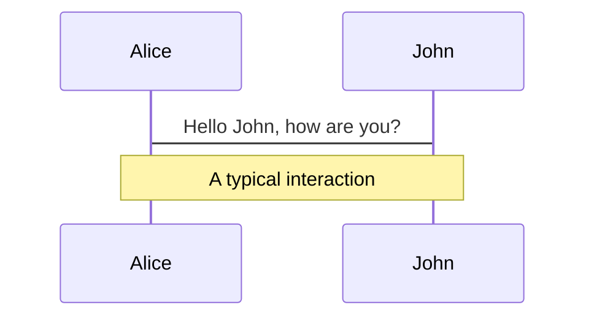

# 首页

内容

<!-- 每一页最后一个注释是备注，会在演示时作为参考 -->

---

# 特点
- 让你专注文字，而不是图表。官方格式已经够用了
- 基于 markdown，易于用 git 进行多人协作
- 可以使用 html/css，潜力很大
- 作为 html，可以当成组件用，或者发布、开源
- reveal.js，部署更简单，且可以多ppt。slidev 基于markdown，有多分栏功能。
- 代码：https://github.com/slidevjs/slidev
- 文档：https://cn.sli.dev/


---

# 部署

<div grid="~ cols-2 gap-2">

<div>

需要先安装 npm（node.js）
```bash
# step1：下载安装包
# https://nodejs.org/
# step2：看版本
# npm -v
```


```bash
# 初始化项目，然后激活网页服务
npm init slidev

npm run dev

# 安装所需的包
npm install
```

</div>

```bash
# 全局安装
sudo npm i -g @slidev/cli
# 然后可以直接使用 slidev 命令

slidev build --out ./docs --download true
# --out 创建到哪个文件夹，默认 dist。创建后的文件夹中会有 index.html 文件和 assets 目录
# --download 同时生成一份 pdf 供下载，需要先安装 npm i -D playwright-chromium
# 可以自定义导出的名字，例如 exportFilename: amazing，会导出 amazing.pdf

slidev build --base=/more/
# 部署时，往往不部署到根目录，例如，部署到 guofei.site/more/
```

</div>

---

# 支持这些

<div grid="~ cols-3 gap-2">

<div>
代码高亮
```python
print('hello')
```
</div>


LaTeX ： 
$\sqrt{3x-1}+(1+x)^2$


<div>
mermaid

</div>

支持 html、css、markdown

```html
<!-- 分栏 -->
<div grid="~ cols-3 gap-2">
```


```bash
# 下面这个可以用来引入其他页
---
src: ./subpage2.md
---
```


</div>


---
layout: two-cols
---
## 代码：特定行高亮

```
//```ts {2-3|5|all}
function add(
  a: Ref<number> | number,
  b: Ref<number> | number
) {
  return computed(() => unref(a) + unref(b))
}
//```
```

效果：
```ts {2-3|5|all}
function add(
  a: Ref<number> | number,
  b: Ref<number> | number
) {
  return computed(() => unref(a) + unref(b))
}
```


注： 行号从1开始 


::right::

## Monaco：代码框可编辑

```
//```ts {monaco}
console.log('Hello')
console.log('World')
//```
```

效果：
```ts {monaco}
console.log('Hello')
console.log('World')
```


---

# 任意页面都可以插入 TOC

代码：
```
<Toc minDepth="1" maxDepth="5"></Toc>
```

展示：

<Toc></Toc>

---
layout: cover
---
# cover 页

演讲者

时间

---
layout: end
---
# 感谢

[文档](https://www.guofei.site) · [GitHub](https://github.com/guofei9987)


---
layout: center
---
# center布局

123

---

# 额外功能


- 主题：https://cn.sli.dev/themes/use.html
- 自定义: https://cn.sli.dev/custom/#frontmatter-configures
- layout：https://cn.sli.dev/builtin/layouts.html
- 一些例子
    - 官方案例：https://sli.dev/showcases.html
    - https://gastrodia.github.io/demo/
        - https://github.com/gastrodia/demo
- theme：https://github.com/slidevjs/themes
- https://www.bilibili.com/video/BV16a411n7dw/


## 一些配置

```markdown
<!-- 页面切走时，特效为消失 -->
transition: fade-out
<!-- 特效为上翻 -->
transition: slide-up
```


---
layout: image-left
image: https://www.guofei.site/pictures_for_blog/life/me.JPG
class: my-cool-content-on-the-right
---
# 左图右字

内容


---
layout: image
image: https://www.guofei.site/pictures_for_blog/life/me.JPG
---
# 整个图片页

123


---
layout: iframe-left
url: https://www.guofei.site
class: my-cool-content-on-the-right
---
# 左 iframe
123


